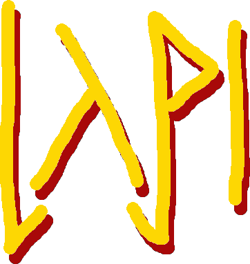

  
  <h3>latinAPI</h3>
  <i>a Latin dictionary and conjugation API</i>

latinAPI is a Flask-based API for conjugating verbs, declining nouns, and various other algorithmic utilities in Latin that can be boiled down to a database.

<h2>Features</h2>
<ul>
  <li>
    Declining/conjugating:
    <ul>
      <li>
        Nouns:
        <ul>
          <li>
            1st delcension
          </li>
          <li>
            2nd delcension
          </li>
          <li>
            3rd delcension
          </li>
          <li>
            4th delcension
          </li>
          <li>
            5th delcension
          </li>
        </ul>
      </li>
      <li>
        Verbs:
        <ul>
          <li>
            Active indicative
          </li>
          <li>
            Passive indicative
          </li>
          <li>
            Active subjunctive
          </li>
          <li>
            Passive subjunctive
          </li>
          <li>
            Infinitive
          </li>
          <li>
            Imperative
          </li>   
        </ul>
      </li>
    </ul>
  </li>
  <li>
    Defining all words listed in Lewis & Short
  </li>
</ul>
<h2>Sources and acknowledgements</h2>
For word stems, i.e. the basis of conjugating verbs:
<ul>
  <li>
    Whitaker (2007) dictionary and Salihbasic's <a href="https://github.com/Salihbasic/whitaker-words-jsonisator/blob/main/output/DICTLINE.json">whitaker-words-jsonisator</a>
  </li>
</ul>
For noun and verb endings:
<ul>
  <li>
    Ben Crowder's charts at <a href="https://bencrowder.net/language-charts/">bencrowder.net</a>
  </li>
</ul>
For definitions:
<ul>
  <li>
    Lewis & Short (1879) dictionary and IohannesArnold's <a href="https://github.com/IohannesArnold/lewis-short-json">lewis-short-json</a>
  </li>
</ul>
